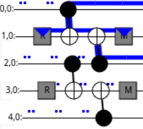

Automatic detector computation
==============================

The ``tqec`` package implements a method to automatically compute detectors from a
given quantum circuit representing a quantum error corrected computation.

An accompanying notebook showcasing the different steps to find detectors is located
`here <media/detectors/detector_computation_illustration.ipynb>`_.

Difference from the main ``tqec`` package
~~~~~~~~~~~~~~~~~~~~~~~~~~~~~~~~~~~~~~~~~

The implementation to automatically find detectors in a given quantum circuit representing
a quantum error corrected computation is currently kept as isolated from the ``tqec`` package
as possible and will very likely be outsourced into its own independent package in the future.
The implementation can be found in ``tqec.circuit.detectors`` and a few restrictions applies
specifically to the code in this sub-module:

- it should be self-contained, or in other words it should not call code from the main
  ``tqec`` package, with the exception of code within ``tqec.circuit.detectors``,
- it should avoid unneeded dependencies. For that reason, the code in ``tqec.circuit.detectors``
  does not use ``cirq`` as its intermediary representation but directly operates on
  ``stim`` data-structures.

Concepts used through the sub-module
~~~~~~~~~~~~~~~~~~~~~~~~~~~~~~~~~~~~

A few core concepts are re-used through the whole sub-module. This section aims at
presenting these core concepts in an accessible manner.

Terms that are conventionally used in quantum computing, such as "circuit", will not
be defined here.

.. _moments-section:

Moments
^^^^^^^

The concept of "moment" is central to the sub-module. A "moment" is a portion of a
quantum circuit that is located between two ``TICK`` instructions. Conventionally,
moments may end with a ``TICK`` instruction, but do not start with one.

This definition is close, but not equivalent, to the definition used by ``cirq``. One of
the main difference is that ``cirq`` defines a moment as a sub-circuit of depth 1: no
instruction in the moment overlaps with another instruction in the same moment.
In the definition given above, there is no notion of depth, and even though ``TICK``
instruction are generally used in ``stim`` such as the moment definition above
is equivalent to the definition used by ``cirq``, this is not required.

For example, the circuit

.. code-block::

    R 0 1 2 3 4
    TICK
    CX 0 1 2 3
    TICK
    CX 2 1 4 3
    TICK
    M 1 3
    DETECTOR(1, 0) rec[-2]
    DETECTOR(3, 0) rec[-1]
    M 0 2 4
    DETECTOR(1, 1) rec[-2] rec[-3] rec[-5]
    DETECTOR(3, 1) rec[-1] rec[-2] rec[-4]
    OBSERVABLE_INCLUDE(0) rec[-1]

contains 4 moments.

Fragments
^^^^^^^^^

Fragments are a collection of moments that check the following order:

1. zero or more moments exclusively composed of `reset`, annotation or
   noisy-gate instructions,
2. zero or more moments composed of "computation" instructions (anything
   that is not a measurement, a reset, a noisy gate or an annotation),
3. one or more moments exclusively composed of `measurement`, annotation
   or noisy-gate instructions.

The circuit provided in :ref:`moments-section` contains 4 moments that form
a fragment.

Note that the circuit

.. code-block::

    M 1 3
    DETECTOR(1, 0) rec[-2]
    DETECTOR(3, 0) rec[-1]
    M 0 2 4
    DETECTOR(1, 1) rec[-2] rec[-3] rec[-5]
    DETECTOR(3, 1) rec[-1] rec[-2] rec[-4]
    OBSERVABLE_INCLUDE(0) rec[-1]

also form a fragment!

Flows
^^^^^

Stabilizers can propagate through a fragment, but can also be created or destroyed by it.

Let's use the following quantum circuit to illustrate:

.. code-block::

    R 1 3
    TICK
    CX 0 1 2 3
    TICK
    CX 2 1 4 3
    TICK
    M 1 3

You can also `check it interactively using crumble <https://algassert.com/crumble#circuit=Q(0,0)0;Q(1,0)1;Q(2,0)2;Q(3,0)3;Q(4,0)4;R_1_3;TICK;CX_0_1_2_3;TICK;CX_2_1_4_3;TICK;M_1_3;DT(1,0,0)rec[-2];DT(3,0,0)rec[-1]_rec[-2];DT(3,0,1)rec[-1]/>`_.

This quantum circuit can "propagate" a stabilizer, for example if a ``Z`` stabilizer
on qubit ``2`` is given as input, a ``Z`` stabilizer on qubit ``2`` is propagated
through:

The quantum circuit also "creates" propagation of stabilizers with its resets, as
shown in the illustration below:

Here, the fragment is creating a ``Z0Z2`` stabilizer: the ``Z`` Pauli string
comes out of the final moment of the fragment on qubits ``0`` and ``2``.

Quantum circuit can also "destroy" some incoming stabilizers with its measurements
as shown below:

Here, the fragment is destroying an incoming ``Z0Z2`` stabilizer.

These three kinds of stabilizer propagation are "flows". A "flow" is describing the
way a stabilizer propagates through a fragment.

Collapsing operations
^^^^^^^^^^^^^^^^^^^^^

Collapsing operations are operations that are involved in the collapsing
(i.e., "destruction") or "creation" of flows.

Measurements and resets are the only collapsing operations.

Note that, by construction, collapsing operations can only be encountered at the
boundaries (beginning/end) of a fragment.

Boundary stabilizers
^^^^^^^^^^^^^^^^^^^^

An important data-structure used in the package is ``BoundaryStabilizer``. This
data-structure represents the state of a flow at the boundaries of a fragment.
It stores:

1. a Pauli string, representing the state of a flow that propagated from one boundary,
   just before encountering the collapsing operations of the other boundary,
2. a list of Pauli strings, each representing one of the collapsing operations that
   will be encountered by the propagated Pauli string,
3. a list of measurements that are involved (either as sources for a destruction flow
   or as sinks for a creation flow) in the flow propagation and that will be used later
   to know which measurements to include in the detectors.

Taking the above example, the following flow:

can be represented by a ``BoundaryStabilizer`` instance with the following attributes:

1. ``Z0Z1Z2`` for the stabilizer, as before encountering the measurement, the propagated
   stabilizer is ``Z0Z1Z2``.
2. ``[Z1, Z3]`` as collapsing operations, as the measurements present in the above circuit
   are performed in the ``Z`` basis, and on qubits ``1`` and ``3``.
3. a data-structure that will represent the measurement performed on qubit ``1``, as the
   only measurement that is taking part in the stabilizer propagation is this one.

As another example, the following flow:

can be represented by a ``BoundaryStabilizer`` instance that has exactly the same attributes
as the one described above.

To distinguish between these two ``BoundaryStabilizer`` (one representing a creation flow,
the other representing a destruction flow), they will be stored in a data-structure that
will differentiate creation and destruction flows: ``FragmentFlow`` (or ``FragmentLoopFlow``).
