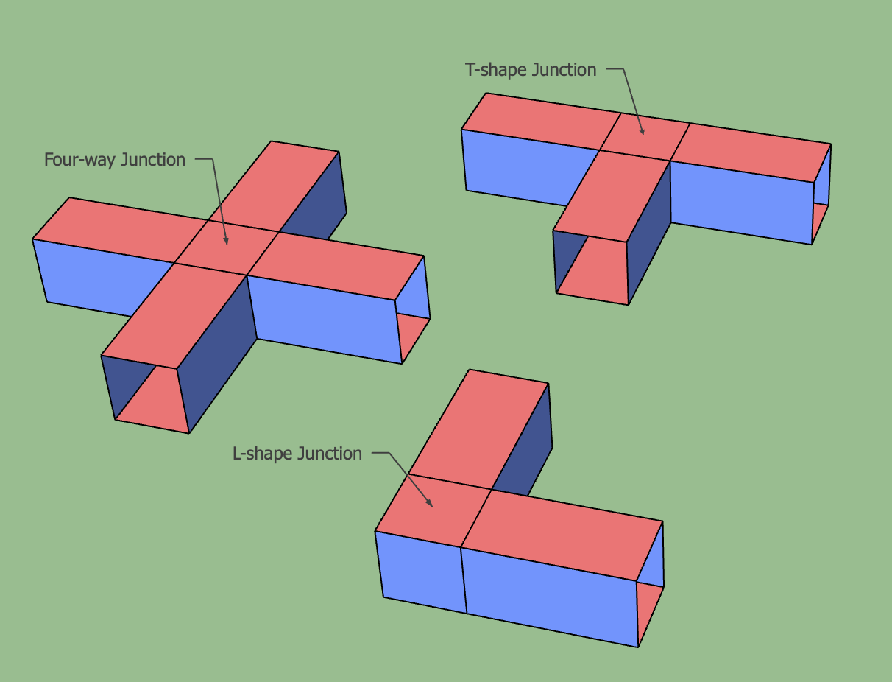

Terminology
===========

This page provides definitions for some important terms used in the ``tqec`` codebase.
Also, we highlight and expand on some concepts that can not fit in the :ref:`API Reference <api>`.

.. _block:

Block
-----

Represents a block of quantum operations that are local in spacetime.
The quantum operations within the block are carefully designed to map logical operators in spacetime correctly.
At the same time, these operations generate syndrome information that protects the logical data, ensuring fault tolerance.

By composing blocks, we can construct the desired mappings between logical operators
while preserving the protection of the logical information.
This is the essence of fault-tolerant quantum computation.

In ``tqec``, a block is either a :ref:`Cube <cube>` or a :ref:`Pipe <pipe>`.

.. _cube:

Cube
----

Represents the fundamental building :ref:`block <block>` that occupies certain spacetime volume. The kind of cube determines the
quantum operations that are applied within the cube. Currently we have the following kinds of cubes, and more cubes can be added in the future:

   Different kinds of cubes

:py:class:`~tqec.computation.ZXCube`
~~~~~~~~~~~~~~~~~~~~~~~~~~~~~~~~~~~~

A cube whose all faces are of ``X`` (red) or ``Z`` (blue) type. We assume each pair of opposite faces are of the same type.
Then the kind can be specified by the type of the faces looking from the XYZ directions. For example, the `ZXZ` cube in the
figure above has ``Z`` type faces along the X direction, ``X`` type faces along the Y direction, and ``Z`` type faces along the Z direction.

A ``ZXCube`` occupies :math:`\approx d^3` spacetime volume, where :math:`d` is the code distance.

Note that ``ZXZ``, ``XZZ``, ``ZXX`` and ``XZX`` cubes can represent a (trivial) logical computation by themselves, i.e. the logical memory experiment.
For example, the ``XZX`` cube can be used to represent a logical qubit with ``Z``/``X`` boundaries parallel to the X/Y axes. And the time boundary
is of ``X`` type, which means that the logical qubit is initialized and measured in the logical ``X`` basis.

Spatial Junction
++++++++++++++++

Unlike the other ``ZXCube``, ``XXZ`` and ``ZZX`` cubes can not represent a logical computation by themselves. They need to be connected to other cubes
in space to form part of a logical computation:

   Spatial junctions

The circuits that implement these spatial junctions are more complex than the circuits for the other cubes, and special care needs to be taken to avoid
the hook errors from decreasing the circuit-level code distance.

:py:class:`~tqec.computation.YCube`
~~~~~~~~~~~~~~~~~~~~~~~~~~~~~~~~~~~

A green cube representing inplace Y-basis logical initialization or measurement as proposed in `this paper <https://quantum-journal.org/papers/q-2024-04-08-1310/>`_.
The cube's function, whether for initialization or measurement, is determined by its connection to other cubes, either upwards or downwards.

A ``YCube`` occupies :math:`\approx d^3 /2` spacetime volume, where :math:`d` is the code distance.

:py:class:`~tqec.computation.Port`
~~~~~~~~~~~~~~~~~~~~~~~~~~~~~~~~~~

A port is a special type of cube that represents the input or output of a logical computation.
It functions as a virtual cube, serving only as a placeholder for other sources or sinks of logical information.
Therefore, ports are not visualized in spacetime diagrams and occupy zero spacetime volume.

.. _pipe:

Pipe
----

Correlation Surface
-------------------

Abstract Observable
-------------------

Plaquette
---------

Subtemplate
-----------

Template
--------

Detector
--------
