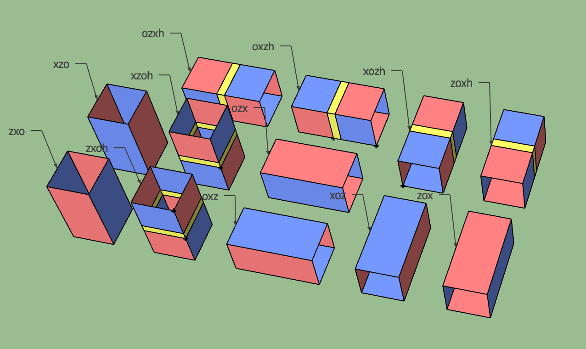

Terminology
===========

This page provides definitions for some important terms used in the ``tqec`` codebase.
Also, we highlight and expand on some concepts that can not fit in the :ref:`API Reference <api>`.

.. _block:

Block
-----

Represents a block of quantum operations that are local in spacetime.
The quantum operations within the block are carefully designed to map logical operators in spacetime correctly.
At the same time, these operations generate syndrome information that protects the logical data, ensuring fault tolerance.

By composing blocks, we can construct the desired mappings between logical operators
while preserving the protection of the logical information.
This is the essence of fault-tolerant quantum computation.

In ``tqec``, a block is either a :ref:`Cube <cube>` or a :ref:`Pipe <pipe>`.

.. _cube:

Cube
----

Represents the fundamental building :ref:`block <block>` that occupies certain spacetime volume. The kind of cube determines the
quantum operations that are applied within the cube. Currently we have the following kinds of cubes, and more cubes can be added in the future:

.. figure:: ../media/user_guide/terminology/cubes.png
   :width: 400px
   :align: center

   Different kinds of cubes

.. _zxcube:

:py:class:`~tqec.computation.ZXCube`
~~~~~~~~~~~~~~~~~~~~~~~~~~~~~~~~~~~~

A cube whose all faces are of ``X`` (red) or ``Z`` (blue) type. We assume each pair of opposite faces are of the same type.
Then the kind can be specified by the type of the faces looking from the XYZ directions. For example, the `ZXZ` cube in the
figure above has ``Z`` type faces along the X direction, ``X`` type faces along the Y direction, and ``Z`` type faces along the Z direction.

A ``ZXCube`` occupies :math:`\approx d^3` spacetime volume, where :math:`d` is the code distance.

Note that ``ZXZ``, ``XZZ``, ``ZXX`` and ``XZX`` cubes can represent a (trivial) logical computation by themselves, i.e. the logical memory experiment.
For example, the ``XZX`` cube can be used to represent a logical qubit with ``Z``/``X`` boundaries parallel to the X/Y axes. And the time boundary
is of ``X`` type, which means that the logical qubit is initialized and measured in the logical ``X`` basis.

Spatial Junction
++++++++++++++++

Unlike the other ``ZXCube``, ``XXZ`` and ``ZZX`` cubes can not represent a logical computation by themselves. They need to be connected to other cubes
in space to form part of a logical computation:

.. figure:: ../media/user_guide/terminology/spatial_junctions.png
   :width: 450px
   :align: center

   Spatial junctions

The circuits that implement these spatial junctions are more complex than the circuits for the other cubes, and special care needs to be taken to avoid
the hook errors from decreasing the circuit-level code distance.

:py:class:`~tqec.computation.YCube`
~~~~~~~~~~~~~~~~~~~~~~~~~~~~~~~~~~~

A green cube representing inplace Y-basis logical initialization or measurement as proposed in `this paper <https://quantum-journal.org/papers/q-2024-04-08-1310/>`_.
The cube's function, whether for initialization or measurement, is determined by its connection to other cubes, either upwards or downwards.

A ``YCube`` occupies :math:`\approx d^3 /2` spacetime volume, where :math:`d` is the code distance.

:py:class:`~tqec.computation.Port`
~~~~~~~~~~~~~~~~~~~~~~~~~~~~~~~~~~

A port is a special type of cube that represents the input or output of a logical computation.
It functions as a virtual cube, serving only as a placeholder for other sources or sinks of logical information.
Therefore, ports are not visualized in spacetime diagrams and occupy zero spacetime volume.

.. _pipe:

Pipe
----

Represents the :ref:`block <block>` that maps logical operators between different :ref:`cubes <cube>`.
There are various types of pipes based on the boundary types and connection direction. Additionally,
Hadamard transitions may occur in the pipe, which changes the basis of the logical operator passing through it.

   Different types of pipes

**It's important to note that the pipe does not occupy spacetime volume by itself.**
Instead, the operations within the pipe replace the operations in the cubes it connects.
The pipe’s visual representation in the diagram is exaggerated for clarity.

   Example of pipes connecting cubes

Each cube in the figure above should initially be thought of as an

.. math::

   InitZ_k \rightarrow (2k − 1) \times Mem_k \rightarrow MeasZ_k

memory experiment. The pipes modify the walls of these experiments. The first vertical pipe should be interpreted as a layer of memory circuit :math:`Mem_k`.
It replaces :math:`MeasZ_k` in the bottom cube and :math:`InitZ_k` in the top cube with :math:`Mem_k` layers.
The horizontal pipe replaces the boundary walls of the two cubes it touches with connecting stabilizer measurements, along with appropriate data qubit initialization and measurement.

Correlation Surface
-------------------

A correlation surface in a computation is a set of measurements whose values determine the parity of the logical operators at the inputs and outputs associated with the surface.

The correlation surface establishes a mapping from the input logical operators to the output logical operators associated to it.
And the mapping implements the desired logical computation up to some sign that depends on the parity of the physical initialization,
measurements and stabilizer measurements included in the correlation surface. In ``tqec``, we assume all the qubits are initialized
to the +1 eigenstate of the operators. Therefore, the sign is determined by the parity of the measurements.

Here we take the movement of a logical qubit for example:

   Movement of a logical qubit

The movement operation maps :math:`Z_L, X_L` logical operators at input to :math:`Z_L^{\prime}, X_L^{\prime}` at output.
Firstly, we show in detail why the structure and circuits above implement the movement of a logical qubit.

a. All data qubits initialized to :math:`|0\rangle`.
b. :math:`2k + 1` rounds of stabilizer measurement.
c. Beginning to extend the logical qubit with more data qubits initialized to :math:`|0\rangle`. Black dots represent data qubits doing nothing.
   :math:`Z_L` can be extended without sign change across these :math:`|0\rangle` values.
d. :math:`2k + 1` rounds of stabilizer measurement during which stabilizers indicated with red dots are used to move :math:`X_L`.
   The parity of any chosen round of these measurements sets a sign relationship between :math:`X_L` and :math:`X_L^{\prime}`.
   Our convention is to choose the earliest round.
e. :math:`Z` basis measurement of data qubits. The parity of the blue highlighted raw values sets
   a sign relationship between :math:`Z_L` and :math:`Z_L^{\prime}`.

Note that the sign relationship described above depends on the measurement outcomes, which are error-prone and need
error correction.

Tracking the process of logical operator movement above, we can get the following two correlation surfaces:

   Correlation surfaces, red for X and blue for Z

You can think of constructing the correlation surface as moving a line of logical operators through the structure,
only allowing the logical operators to attach to walls with the same basis.
The physical qubit measurements and stabilizer measurements in the correlation surface determine the sign relationship between the logical operators at the input and output.

Plaquette
---------

Subtemplate
-----------

Template
--------

Detector
--------
