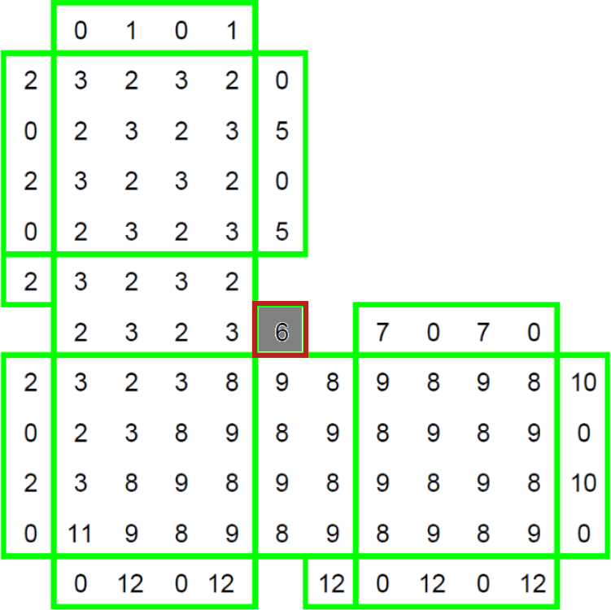

# List of things to do for the library

## Better input description for plaquette indices

> [!WARNING]
> Currently, plaquette indices are given as lists of integers. 
> This is problematic because the user have no clue about which index is going where on the final plaquette. 

### Example

The `ScalableAlternatingSquare` template interface is:
```python
class ScalableAlternatingSquare:
    def __init__(
        self, dimension: int, scale_func: ty.Callable[[int], int] = lambda x: x
    ) -> None:
        # ...

    def to_dict(self) -> dict[str, ty.Any]:
        # ...

    def scale_to(self, k: int) -> Template:
        # ...

    def instanciate(self, x_plaquette: int, z_plaquette: int, *_: int) -> numpy.ndarray:
        # ... 
    
    @property
    def shape(self) -> tuple[int, int]:
        # ...
```

Leaving aside the fact that the parameters names of the `instanciate` method do not really correspond to the reality (which is an early mistake that will need to be fixed eventually), the user would likely prefer to know exactly which parameter corresponds to which plaquette on the 2-dimensional visualisation.

In general, and as seen in the [README](./README.md), plaquette numbers and how they are passed down to the generated array are pretty unclear:
```python
template_instances = [
    # Plaquette numbers here are NOT self-explanatory at all...
    # and the input method is not really robust to typos.
    TemplateWithPlaquettes(ScalableAlternatingSquare(4), [3, 4]),
    TemplateWithPlaquettes(ScalableRectangle(4, 1), [0, 1]),
]
```

### Origin of the problem

The code as been started with the "let's start with simple numbers and see what happens" philosophy. We now see what happened. And we should likely change it.

### Tracks to solve the issue

There are several ways that can be explored.

A first idea would be to **document**: write docstrings, give good names to the method parameters, ... This will need to be done eventually, even if this issue is solved by another way. But I see a few issues with that:
- I do not have good ideas for parameter names. A good idea would be a parameter name that is self-explanatory: anyone reading it should immediatly **know** what it corresponds to, without having to look elsewhere. Ideas welcome.
- Docstrings will also be necessary, but will very quickly become unusable. Imagine having a docstring (so ASCII text) representing a distance 5 corner, with 12 different plaquettes... Would you qualify this as self-explanatory and easy to read?

A second idea would be to rely on well explained conventions, which is how I did it in the first place. My conventions were:
1. The first plaquette is always the top-left one.
2. The second plaquette is always the one on the right of the first one.
3. The potential following plaquettes are disambiguated with the method parameter name when possible, or simply hard-coded because I was out of ideas.

## Verification of templates

> [!WARNING]
> Currently, the user is assumed to be a perfect entity that is always right. You'll likely find dozens of QA people to (rightfully) contradict this.
> This means that the generated QEC codes are not checked at all.

### Example

Creating a `TemplateWithPlaquettes(FixedRaw([[0, 0], [0, 0]]), [1])` would create, **without raising any warning**, a template of fixed size with 4 times the **same** plaquette, which does not seem to have an interesting application and should probably be seen as "probably a user mistake". 

### Origin of the problem

Verification is not the primary goal for the moment, so it was not a priority to implement.

### Tracks to solve the issue

I can see a two-scale process:
1. Each instance of `Template` can check that the plaquettes arangement it implements does not raise any issue, diregarding any potential interactions with other neighbouring `Template` instances.
2. Each pair of neighbouring `Template` could be checked by the `TemplateOrchestrator` for any issue between the edges of neighbouring templates.

This would require changing the interface of `Template` to include a way to ask for it to check itself and a way to access information about the plaquettes on its border, but seems manageable.

## Think about unit squares

> [!WARNING]
> Currently, two neighbouring templates have to share a dimension. 
> In particular, this means that some 1x1 squares are (in theory) not encodable. 

> [!IMPORTANT]
> This should be fixed by allowing both relative positioning of templates (as before) AND corner positioning (as introduced in the same commit that introduced this text).

### Example
The 1x1 square highlighted in the image below is concerned by this limitation.



None of the dimensions of the neighbouring templates (i.e. green rectangles in the image above) match exactly the 1x1 square.

Other examples of cases that are outside of the current limitations:
1. the two 1x1 squares in the W shape that are in a similar place as the problematic 1x1 square in the corner (see previous point),
2. the two 1x1 squares in the donut shape that are top right and bottom left of the inside empty square.

### Origin of the problem

The graph structure used to arrange templates has been though to support simple relationships:
- above of,
- below of,
- left of,
- right of,
and nothing more involved. Just using this limited information, it is impossible to uniquely and unambiguously encode the position of the 1x1 square in the example above.

It could be "above of" the template below itself, but then two choices come up: "above of... on the left" or "above of... on the right"? The same applies to "left of" and the template on the left of the 1x1 square.
Finally, this is quite a special case and in general:
- the 1x1 square *could* be a rectangle and
- the supporting template could be any size.
So the general problem is "how to position something of size k along n > k positions"? Even though the problem by itself is quite easy (e.g., by storing another index to encode the position), it adds complexity to the library and more importantly to the user, that will have to provide this information.

### Tracks to solve the issue

The first question is: "should we try to solve this issue?". All the examples I can think of are solvable by replacing the 1x1 square plaquette by a fixed-size 2x2 square template, containing the 1x1 square plaquette on the correct spot and "no plaquettes" (encoded as zeros for the moment) elsewhere.

Also, really complex use cases can always (?) be fixed by the definition of a new template. It is more cumbersome, but might be justifiable for power-users that try to push the tool as far as possible.
